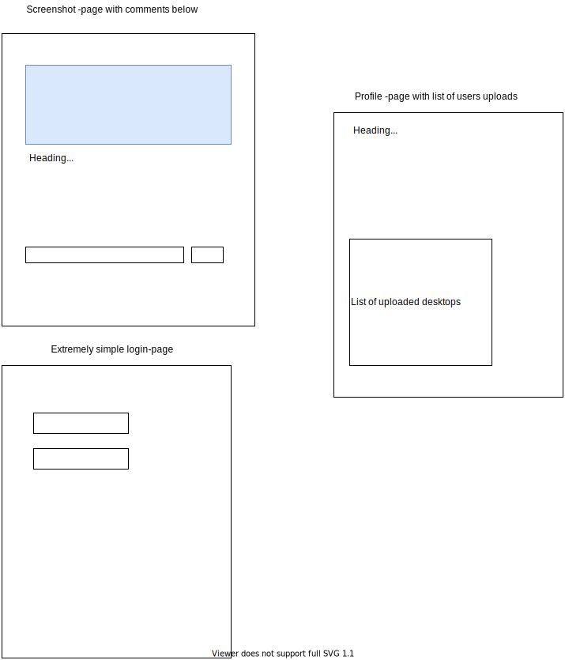

# Rate my desktop

## Contents

- [Description](#Description)
- [User stories](#User-stories)
- [Wireframes](#Wireframes)
- [Database](#Database)
- [Testing](#Testing)
- [Api](#Api)
- [Frontend](#Frontend)
- [Installation](#Installation)

## Description

Rate-my-desktop is a website where users can post screenshots of their desktop and other users can rate them. It also contains a commenting functionality. 

As this is a final exercise of a [course](https://opinto-opas.haaga-helia.fi/course_unit/SWD4TA020) at Haaga-Helia university of applied sciences, it has some restrictions on the technologies chosen. ([similar description in English](https://opinto-opas.haaga-helia.fi/course_unit/SWD4TF021))

Project has to be done using Spring Boot and webpages have to be rendered using Thymeleaf. I think there is some freedom on database selection, but I am going for MariaDB. I will publish this service using Docker and I will use CI-tools from Github. 

## User stories

| id | description | status |
|----|----         |---- |
| 1  | As a user, I want to be able to create account without handing personal information as I want to be sure of how my information is stored | done |
| 2 | As a user, I want to be able to post my screenshot to the site to get comments about it | done | 
| 3 | As a user, I want to be able to easily find my screenshots to see their ratings and read their comments. | done |
| 4 | As a user, I want to be able to comments other peoples screenshots so they can read what I like about them (or don't like about them). | done |
| 5 | As a user, I want to be able to change my account name and password in case I think my password is compromised | done | 
| 6 | As a user, I want to be able to delete screenshots I've uploaded in case I accidentally upload wrong pic or notice something I don't want others to see in it. | done |
| 7 | As a user, I want others to be able to rate my screenshot so I know it it's cool or not | done |
| 8 | As an admin, I want to be able to delete screenshots in case there is something inappropriate in it. |
| 9 | As an admin, I want to be able to delete individual comments in case there is something inappropriate in it. | 
| 10 | As an admin, I want to be able to lock accounts in case they keep on harrassing others |

## Wireframes

Since this is a backend-course, the frontend is kept quite simple. 

## Database

Database relation model: [Relationmodel.svg](Docs/Database/Relationmodel.svg)

### User

*Users are stored in this table. No additional data is gathered (like email, real name etc.)*

| Field | Type | Description |
|----  |---- | -----|
| userID | int PK | id of the user |
| levelID | int FK | what is the level of the user (locked/user/admin/etc.). Refers to [UserLevel](#UserLevel) |
| username | varchar(100) | username for the user |
| password | varchar(200) | password for the user |

### UserLevel

*This table contains different access levels the users might have*

| Field | Type | Description |
|----|----|----|
| levelID | int PK | id of the level |
| name | varchar(100) | a clear text name for the level (seen in profile) |
| value | varchar(100) | a value used in the code (like 'ADMIN' or 'USER') |

### Screenshot

*This is the table used to store screenshots. Actual images are stored on disk, but this table contains a filename for finding the correct file.*

| Field | Type | Description |
|----|----|----|
| screenshotID | int PK | id for the screenshot |
| userID | int FK | used for finding the owner of the screenshot. Refers to [User](#User) |
| screenshot_name | varchar(100) | Give a kewl name for your screenshot |
| filename | varchar(100) | A generated name used for accessing the file from disc. |

### Comment

*This table stores comments posted on screenshots.*

| Field | Type | Description |
|----|----|----|
| commentID | int PK | id for the comment |
| screenshotID | int FK | id for the [screenshot](#Screenshot) |
| userID | int FK | id for the [user](#User) who posted the comment |
| comment | varchar(255) | the actual comment shown on the page |
| timestamp | datetime | date & time when the comment was posted |

### Rating 

*This table contains the ratings for the screenshots.*

| Field | Type | Description |
|----|----|----|
| ratingID | int PK | id for the rating |
| screenshotID | int FK | id for the [screenshot](#Screenshot) |
| userID | int FK | id for the [user](#User) who gave the rating |
| rating | int | the actual value given for the screenshot (1-5) |

## Testing

We use JUnit-tests for unit testing. Github Actions is used for automatic tests on Main-branch. 

### JUnit tests

Junit tests will include the following:

1. Smoketests for all controllers.
2. Basic rendering tests for `WebController` that renders all Thymeleaf-templates. 
3. Tests for all Jpa Repositories. 

### Manual testcases

Other tests include following testcases:

#### Registration

1. User goes to `/`. 
2. User click `Register`.
3. User hands out empty username and valid password twice.
    - User is returned to registration form and page warns of invalid username
4. User enters a used username and valid password twice. 
    - User is returned to registration form and page warns of invalid username
5. User enters valid and non-taken username and two different passwords. 
    - User is returned to registration form and page warns of non-matching passwords. 
6. User enters valid username and valid passwords. 
    - User is returned to login-page. 

#### Change password

1. User goes to `/`. 
2. User clicks `Login`. 
3. User enters username and password. 
4. User clicks his/her username. 
    - Profile-page is displayed. 
5. User enters his/her password correctly and a new password twice correctly. 
    - User is returned to profile-page and message tells password is changed. 
6. User clicks `Logout`. 
7. User clicks `Login`. 
8. User uses new password to login. 
    - User is logged in succesfully. 

#### Upload screenshot

1. Let's assume user is logged in and Profile-page is displayed. 
2. User chooses an image-file (jpeg or png). 
3. User gives the screenshot a valid name. 
4. User click `Upload`. 
    - Message tells image is saved and screenshot with the given name is added to list at the bottom of the page. 

## Api

Here is the list of REST endpoints. Base url for api is: `/api`

### Screenshots

Each endpoint will hand out information about a screenshot. There is also an endpoint to list ALL screenshots, should someone want to use that. 

| Method | Path | Access | Description |
|---- |---- |------ | ---- |
| `GET` | `/screenshots/random` | Open | Gives random screenshot information from database |
| `GET` | `/screenshots/:id` | Open | Gives information for the screenshot with given id |
| `GET` | `/screenshots` | Open | Lists all screenshots |
| `DELETE` | `/screenshots/:id` | Admin, Owner | Deletes screenshots with given id | 

### Comments

These endpoints are used to handle comments of screenshots. 

| Method | Path | Access | Description |
|---- |-----| -----| ----- |
| `GET` | `/comments/:id` | User | Get all comments for screenshot with id |
| `POST` | `/comments/:id` | User | Add comment to screenshot with id | 
| `DELETE` | `/comments/:id` | Admin | Delete **comment** with id, only available for admin |

### Rating

These endpoints are used to handle rating of screenshots. 

| Method | Path | Access | Description |
|---- |-----| -----| ----- |
| `GET` | `/ratings/:id` | User | Get current rating of screenshot with id | 
| `GET` | `/ratings/rate/:id?newValue=:value` | User | Rate a screenshot with id |

### User

This endpoint will allow current user to modify his/her settings. 

| Method | Path | Access | Description |
| ----- | ----- | ----- | ----- |
| `GET` | `/user` | User | Give (current users) username |
| `GET` | `/user/screenshots` | User | List (current)users screenshots |
| `PUT` | `/user` | User | Update profile (username & password) | 

### Users

This endpoint is mainly for administrative user. It allows admin to delete accounts. (This endpoint might be left out from final product)

| Method | Path | Access | Description |
| ----- | ----- | ----- | ----- |
| `DELETE` | `/users/:id` | Admin | Allows Admin-level users to delete other accounts | 

## Frontend

As said, frontend is done with Thymeleaf templates. Alot of frontend functionality is done using (Vanilla) Javascript. Vanilla, because it's much faster to hack together some kind of frontend to test the backend. Again: this is backend-course, I glued together the frontend in an hour or so. 

#### Frontend paths

| path | access | description |
|----|-----|-----|
| `/` | open | displays a random screenshot, logged in users can rate & see comments |
| `/:id` | login required | displays screenshot with given :id and allows rating & commenting |
| `/register` | open | allows creation of an account | 
| `/login` | open | allows user to login | 
| `/logout` | open | allows user to logout | 
| `/profile` | login required | allows changing password and uploading/deleting screenshots | 
| `/pics/:id` | open | screenshot image for screenshot with :id | 

## Installation

### Prequisite

You need to have [Docker](https://docs.docker.com/get-docker/) installed and also you need to have [Docker Compose](https://docs.docker.com/compose/install/). You will need `git` to fetch sources in steps below. 

### Installing

TODO

### Running

TODO 

